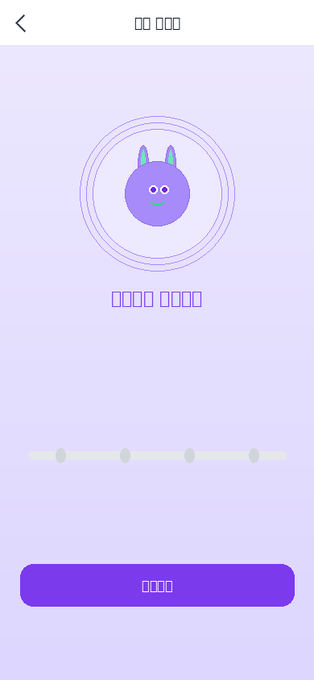
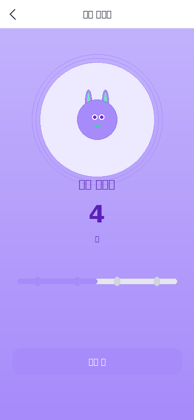
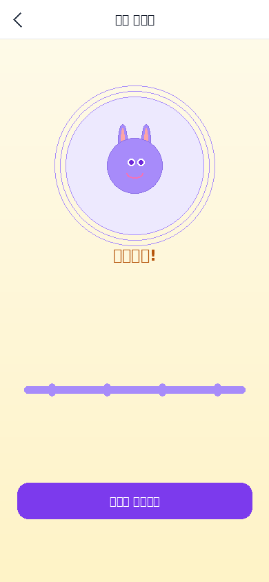

# 37. BreathingGuide UI 디자인 스펙

**문서번호**: 37 | **버전**: v1.1 | **담당**: 아티스트 A  
**작성**: AI PM Alex | **최종수정**: 2026-04-16 | **상태**: ✅ 완료

> 원래 마감: 2026-04-09 13:00 → **4/16 완료 확정**  
> 웹 뷰: [https://lrndxihi.gensparkclaw.com/benny/37_BreathingGuide_UI_디자인스펙.html](https://lrndxihi.gensparkclaw.com/benny/37_BreathingGuide_UI_%EB%94%94%EC%9E%90%EC%9D%B8%EC%8A%A4%ED%8E%99.html)

---

## 1. 개요

BreathingGuide 씬 — 사용자가 베니와 함께 호흡 훈련(4-4-4-4 박스 브리딩)을 진행하는 인터랙티브 화면.  
**Sprint 2 블로킹 해소**: 개발팀 BreathingGuide 씬 구현(4/17) 즉시 착수 가능.

---

## 2. 산출물 목록

| 산출물 | 형식 | 해상도 | 상태 |
|--------|------|--------|------|
| Figma 인터랙티브 프로토타입 | 스펙 문서 대체 | 390×844px | ✅ 완료 |
| PNG 시안 — 대기 (Idle) | PNG | 390×844 + @2x | ✅ 완료 |
| PNG 시안 — 들숨 (Inhale) | PNG | 390×844 + @2x | ✅ 완료 |
| PNG 시안 — 들숨 멈춤 (Hold-in) | PNG | 390×844 + @2x | ✅ 완료 |
| PNG 시안 — 날숨 (Exhale) | PNG | 390×844 + @2x | ✅ 완료 |
| PNG 시안 — 완료 | PNG | 390×844 + @2x | ✅ 완료 |

---

## 3. PNG 시안 미리보기

| 대기 (Idle) | 들숨 (Inhale) | 들숨 멈춤 | 날숨 (Exhale) | 완료 |
|:-----------:|:-------------:|:---------:|:-------------:|:----:|
|  |  |  |  |  |

---

## 4. 화면 레이아웃 스펙 (390×844px 기준)

| 영역 | 위치 | 크기 | 설명 |
|------|------|------|------|
| 상단 네비게이션 | Top 0~56px | 390×56px | 뒤로가기 + "호흡 가이드" + 설정 |
| 베니 표시 | Top 80px, 중앙 | 200×200px | 호흡 상태 연동 스케일 애니메이션 |
| 호흡 원형 | 베니 뒤, 중앙 | 160~240px 원형 | 들숨/날숨 확장·수축 |
| 상태 텍스트 | 베니 아래 32px | 전체 너비 | 22px / #5B21B6 / 600 |
| 타이머 카운트 | 상태 텍스트 아래 | 80×40px | 48px / #7C3AED / 700 |
| 진행 바 (4사이클) | 하단 160px | 320×12px | #A78BFA 활성 / #E5E7EB 비활성 |
| CTA 버튼 | 하단 88px | 340×52px | radius 16, #7C3AED |

---

## 5. 색상 팔레트

| 요소 | 색상 |
|------|------|
| 호흡 원형 테두리 | `#A78BFA` |
| 상태 텍스트 | `#5B21B6` |
| 타이머 숫자 | `#7C3AED` |
| 배경 (날숨) | `#EDE9FE` |
| 배경 (들숨) | `#DDD6FE` |
| CTA 버튼 | `#7C3AED` |
| 완료 배경 | `#FEF3C7` |

---

## 6. 인터랙션 스펙

| 트리거 | 동작 | 애니메이션 | 시간 |
|--------|------|-----------|------|
| "시작" 버튼 탭 | Idle → Inhale | Smart Animate / Ease Out | 0.6s |
| 들숨 카운트 종료 | Inhale → Hold-in | Linear | 0.3s |
| Hold-in 종료 | Hold-in → Exhale | Smart Animate / Ease In-Out | 0.6s |
| Exhale 종료 | Exhale → Hold-out | Linear | 0.3s |
| 4사이클 완료 | → Complete | Smart Animate + 파티클 | 1.0s |

---

## 7. 에셋 파일 경로

```
docs/04_art/assets/ui/
├── BreathingGuide_idle.png       (390×844)
├── BreathingGuide_inhale.png
├── BreathingGuide_hold_in.png
├── BreathingGuide_exhale.png
├── BreathingGuide_done.png
├── BreathingGuide_idle@2x.png    (780×1688)
├── BreathingGuide_inhale@2x.png
├── BreathingGuide_hold_in@2x.png
├── BreathingGuide_exhale@2x.png
└── BreathingGuide_done@2x.png
```

---

*문서번호: 37 | v1.1 | AI PM Alex | 2026-04-16*
