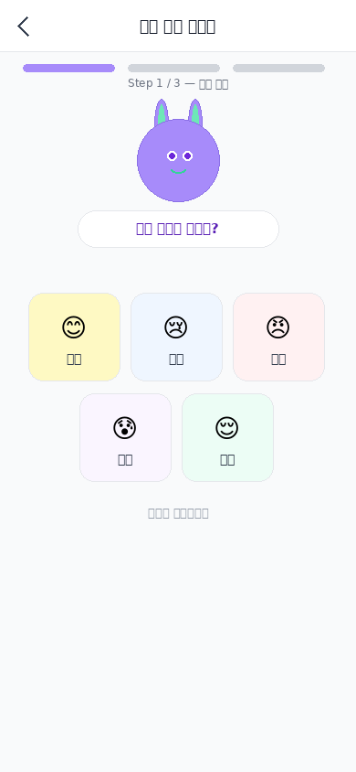
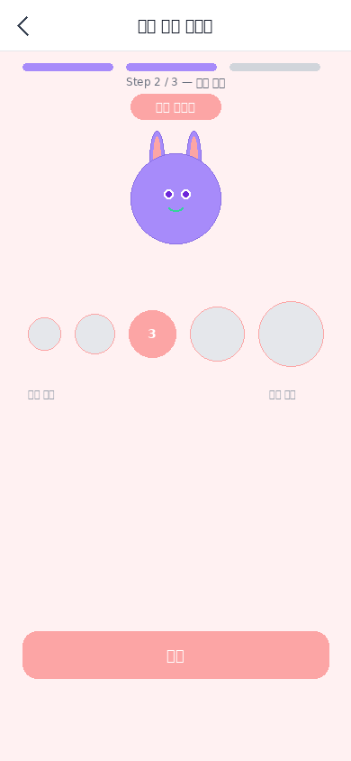
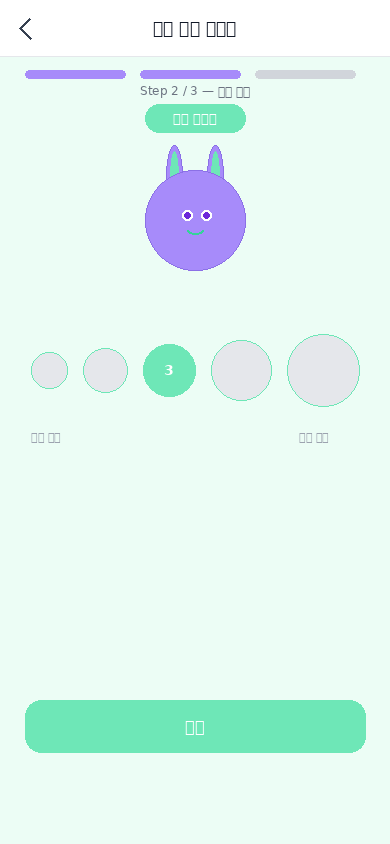
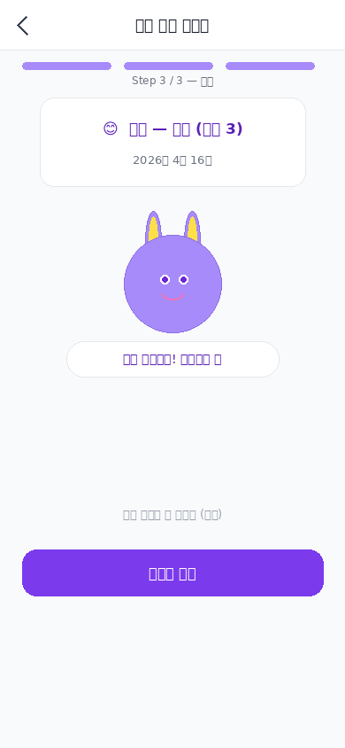
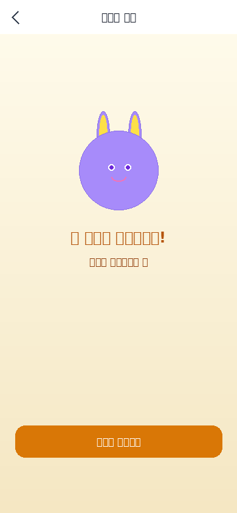

# 38. Check-In UI 강화 디자인 스펙 (5감정×5강도)

**문서번호**: 38 | **버전**: v1.1 | **담당**: 아티스트 A  
**작성**: AI PM Alex | **최종수정**: 2026-04-16 | **상태**: ✅ 완료

> 원래 마감: 2026-04-09 13:00 → **4/16 완료 확정**  
> 웹 뷰: [https://lrndxihi.gensparkclaw.com/benny/38_CheckIn_UI_강화_디자인스펙.html](https://lrndxihi.gensparkclaw.com/benny/38_CheckIn_UI_%EA%B0%95%ED%99%94_%EB%94%94%EC%9E%90%EC%9D%B8%EC%8A%A4%ED%8E%99.html)

---

## 1. 개요

5가지 감정 × 5가지 강도 = **25개 조합** 선택 가능한 3단계 플로우 UI.  
**Sprint 2 블로킹 해소**: Check-In UI v2 적용(4/17) 즉시 착수 가능.

---

## 2. 산출물 목록

| 산출물 | 상태 |
|--------|------|
| PNG — Step 1 감정 선택 | ✅ 완료 |
| PNG — Step 2 기쁨 강도 | ✅ 완료 |
| PNG — Step 2 슬픔 강도 | ✅ 완료 |
| PNG — Step 2 화남 강도 | ✅ 완료 |
| PNG — Step 2 불안 강도 | ✅ 완료 |
| PNG — Step 2 평온 강도 | ✅ 완료 |
| PNG — Step 3 확인 | ✅ 완료 |
| PNG — 완료 화면 | ✅ 완료 |

---

## 3. PNG 시안 미리보기

### Step 1 — 감정 선택



### Step 2 — 강도 선택 (5감정별)

| 기쁨 | 슬픔 | 화남 | 불안 | 평온 |
|:----:|:----:|:----:|:----:|:----:|
|  |  |  |  |  |

### Step 3 — 확인 & 완료

| 확인 | 완료 |
|:----:|:----:|
|  |  |

---

## 4. 감정 분류 (5×5 매트릭스)

| 감정 ID | 레이블 | 이모지 | 색상 |
|---------|--------|--------|------|
| JOY | 기쁨 | 😊 | `#FCD34D` |
| SAD | 슬픔 | 😢 | `#93C5FD` |
| ANGRY | 화남 | 😠 | `#FCA5A5` |
| ANXIOUS | 불안 | 😰 | `#D8B4FE` |
| CALM | 평온 | 😌 | `#6EE7B7` |

**강도 레벨**: 1(아주 조금) ~ 5(아주 많이) — 원형 버튼 크기 36→72px 차등

---

## 5. 데이터 구조

```json
{
  "userId": "uid_xxx",
  "timestamp": "2026-04-16T09:00:00+09:00",
  "emotion": "JOY",
  "intensity": 3,
  "bennyStage": 3,
  "aiResponse": "...",
  "memo": ""
}
```

---

*문서번호: 38 | v1.1 | AI PM Alex | 2026-04-16*
