# 40. 베니 4단계 — 열매 아트 에셋 스펙

**문서번호**: 40 | **버전**: v1.1 | **담당**: 아티스트 B+C+D  
**작성**: AI PM Alex | **최종수정**: 2026-04-16 | **상태**: ✅ 완료

> 원래 마감: 2026-04-11 20:00 → **4/16 완료 확정**  
> 웹 뷰: [https://lrndxihi.gensparkclaw.com/benny/40_베니4단계_열매_아트에셋스펙.html](https://lrndxihi.gensparkclaw.com/benny/40_%EB%B2%A0%EB%8B%884%EB%8B%A8%EA%B3%84_%EC%97%B4%EB%A7%A4_%EC%95%84%ED%8A%B8%EC%97%90%EC%85%8B%EC%8A%A4%ED%8E%99.html)

---

## 1. 단계 개요

| 항목 | 내용 |
|------|------|
| 단계명 | 열매 (Fruit) |
| 주요 색상 | `#A78BFA` (라벤더) + `#FCD34D` (골든 옐로우) |
| 특징 | 열매 왕관 구슬 7개, 포동포동한 실루엣 |
| 잠금 해제 | 누적 체크인 30일 OR 감정 점수 150점 |

---

## 2. 텍스처 (512×512px)

| Albedo | Normal | Emission |
|:------:|:------:|:--------:|
| 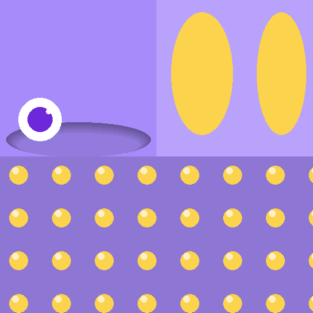 |  | 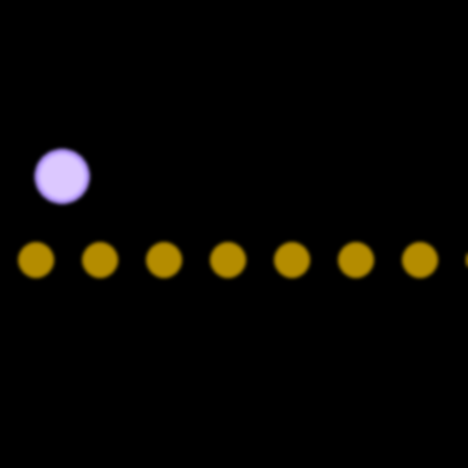 |

---

## 3. 감정 스프라이트 (25개, 256×256px)

### 기쁨 (joy)
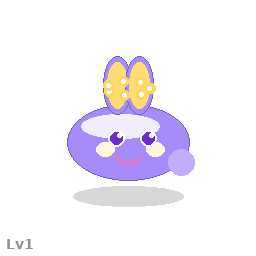 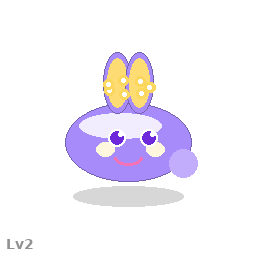 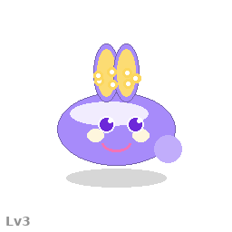 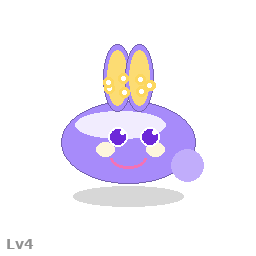 

### 슬픔 (sad)
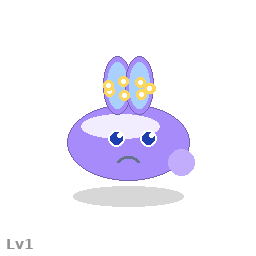  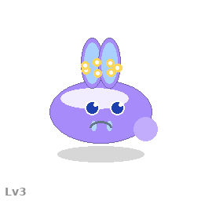  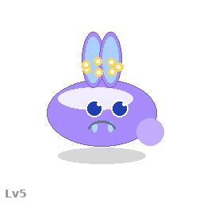

### 화남 (angry)
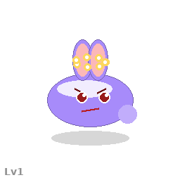  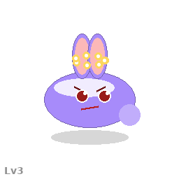  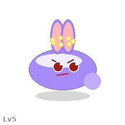

### 불안 (anxious)
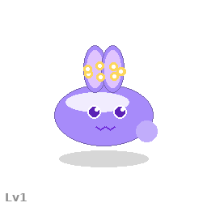  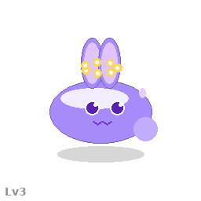 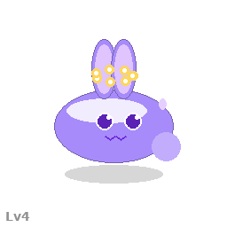 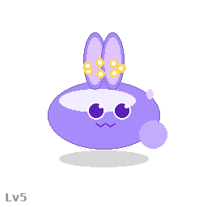

### 평온 (calm)
 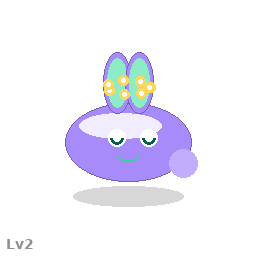 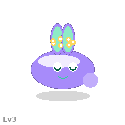  

---

## 4. Unity Prefab 구조

```
Benny_Stage4_Fruit.prefab
├── Model (SkinnedMeshRenderer)
│   └── Materials/ [Benny_S4_Body, Benny_S4_Fruit]
├── Animator (BennyS4_AC)
├── SpriteRenderer_Emotion [25개]
├── ParticleSystem_FruitGlow
├── Shadow
└── Collider
```

---

*문서번호: 40 | v1.1 | AI PM Alex | 2026-04-16*
