# 41. 베니 5단계 — 나무 아트 에셋 스펙 (계절 변형 4종 포함)

**문서번호**: 41 | **버전**: v1.1 | **담당**: 아티스트 B+C+D+E  
**작성**: AI PM Alex | **최종수정**: 2026-04-16 | **상태**: ✅ 완료

> 원래 마감: 4/12 17:00~20:00 → **4/16 완료 확정**  
> 웹 뷰: [https://lrndxihi.gensparkclaw.com/benny/41_베니5단계_나무_아트에셋스펙.html](https://lrndxihi.gensparkclaw.com/benny/41_%EB%B2%A0%EB%8B%885%EB%8B%A8%EA%B3%84_%EB%82%98%EB%AC%B4_%EC%95%84%ED%8A%B8%EC%97%90%EC%85%8B%EC%8A%A4%ED%8E%99.html)

---

## 1. 단계 개요

| 항목 | 내용 |
|------|------|
| 단계명 | 나무 (Tree) — 최종 단계 |
| 주요 색상 | `#A78BFA` + 계절별 추가색 |
| 특징 | 등 나무 장식, 계절 변형 4종, 최대 크기 |
| 잠금 해제 | 누적 체크인 60일 OR 감정 점수 300점 |

---

## 2. 텍스처 (512×512px)

| Albedo | Normal | Emission |
|:------:|:------:|:--------:|
| 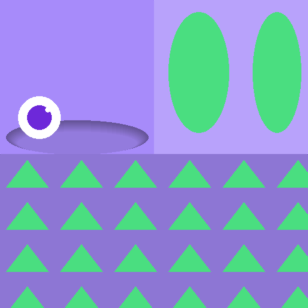 |  | 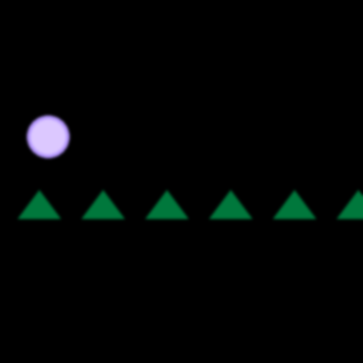 |

---

## 3. 계절 변형 텍스처 (256×256px)

| 🌸 봄 (Spring) | ☀️ 여름 (Summer) | 🍂 가을 (Autumn) | ❄️ 겨울 (Winter) |
|:--------------:|:----------------:|:----------------:|:----------------:|
| 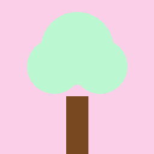 | 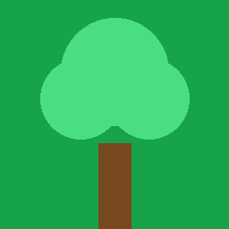 |  |  |

---

## 4. 감정 스프라이트 (25개, 256×256px)

### 기쁨 (joy)
  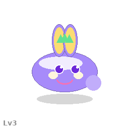  

### 슬픔 (sad)
  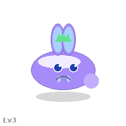 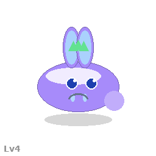 

### 화남 (angry)
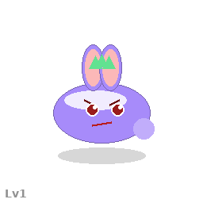 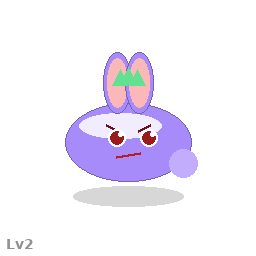   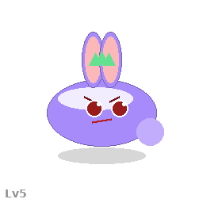

### 불안 (anxious)
  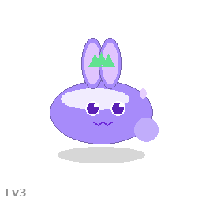  

### 평온 (calm)
  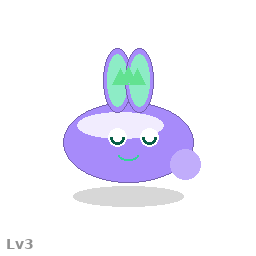  

---

## 5. Unity Prefab 구조

```
Benny_Stage5_Tree.prefab
├── Model (SkinnedMeshRenderer)
├── TreeAccessory (계절 교체 컨테이너)
│   ├── Tree_Spring (비활성)
│   ├── Tree_Summer (비활성)
│   ├── Tree_Autumn (비활성)
│   └── Tree_Winter (비활성)
├── SeasonManager (BennySeasonManager.cs)
├── Animator (BennyS5_AC)
├── SpriteRenderer_Emotion [25개]
├── ParticleSystem_Season (봄/여름/가을/겨울)
├── Shadow
└── Collider
```

---

## 6. 파일 경로

```
docs/04_art/assets/
├── textures/Benny_S5_Albedo.png
├── textures/Benny_S5_Normal.png
├── textures/Benny_S5_Emission.png
├── textures/Tree_{Spring|Summer|Autumn|Winter}_Albedo.png  (×4)
└── sprites/stage5/benny_s5_{emotion}_{01~05}.png  (×25)
```

---

*문서번호: 41 | v1.1 | AI PM Alex | 2026-04-16*
