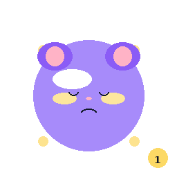
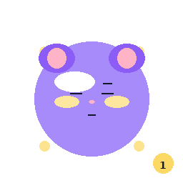
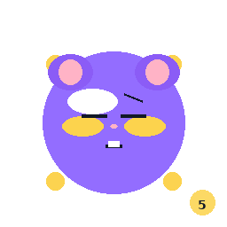

# 베니 4단계 열매 — 아트 에셋 스펙 — 소울나루

베니 4단계 열매 — 아트 에셋 스펙 — 소울나루 

# 🍓 베니 4단계 — 열매 (Fruit)

**2D 제작 기준 업데이트:** 본 문서의 캐릭터/오브젝트/씬 산출물은 정식 이미지 제작 단계에서 2D가 아닌 2D PNG/SVG 스프라이트와 UI 이미지 기준으로 작업합니다. 상세 통합 지침은 [79번 디자인 가이드 및 작업지시서](/benny/79_디자인가이드_작업지시서.html)를 따릅니다.

아트 에셋 전체 스펙 명세서

**문서번호**: 40

**카테고리**: 아트 / 캐릭터 에셋

**담당**: 아티스트 B (이미지 제작) + C (이미지 레이어/스프라이트) + D (Unity UI UI UI 프리팹)

**작성**: AI PM Alex

**작성일**: 2026-04-15

**원래 마감**: 2026-04-11 20:00 ✅ 4/16 완료 확정 

**✅ Sprint 2 블로킹 해소 (4/16)**

3단계 에셋 완료 직후 착수. 정원 씬 전체 베니 성장 로직 구현에 필요합니다.

## 1. 단계 개요 — 열매 (Fruit)

| 항목 | 내용 |
| --- | --- |
| 단계 번호 | 4단계 |
| 단계명 | 열매 (Fruit) |
| 성장 스토리 | 꽃이 지고 달콤한 열매가 맺히는 단계. 베니가 감정 조절 능력을 갖추고 사용자에게 지혜를 나눠줄 수 있게 됨. |
| 주요 색상 | #A78BFA (라벤더 바이올렛) + #FCD34D (골든 옐로우) |
| 3단계 대비 특징 | 꽃잎 패턴 → 열매 패턴. 몸통에 작은 열매 장식. 꼬리가 풍성해짐. 전체적으로 더 포동포동한 실루엣. |
| 잠금 해제 조건 | 누적 체크인 30일 이상 OR 감정 점수 총합 150점 이상 |

## 2. 산출물 목록 및 스펙

### 2-1. 2D 이미지 제작

| 산출물 | 파일 형식 | 2D 해상도 수 | 해상도 단계 | 상태 |
| --- | --- | --- | --- | --- |
| 베니 4단계 메인 이미지 | PNG 스프라이트 + OBJ | ≤ 1,000 폴리 | 해상도 단계0: 1000 / 해상도 단계1: 500 / 해상도 단계2: 200 | ✅ 완료 |

**이미지 제작 상세 규격 (3단계와 동일 기준):**

- 단위: 미터법 (1unit = 1m)

- 베니 전체 높이: 0.65m (3단계 대비 5% 성장)

- 피벗 포인트: 발바닥 중앙 (0, 0, 0)

- 정면 방향: +Z축

- UV 맵: 단일 UV 채널, 0~1 범위, 겹침 없음

- 뼈대(Rig): Humanoid + 꼬리 체인 (4조인트) + 열매 본 (6개) 추가

#### 4단계 전용 이미지 특징

- 몸통: 열매 6개 부조 패턴 (3단계 꽃잎 → 열매로 대체)

- 머리: 황금빛 열매 왕관 (작은 구슬 형태 7개)

- 꼬리: 더 굵어지고 끝부분에 큼직한 열매 장식

- 전체 실루엣: 3단계 대비 복부 5% 포동포동하게 조정

- 눈: 3단계보다 더 반짝이는 표현 (Highlight 강도 20% 증가)

### 2-2. 이미지 레이어

| 산출물 | 파일 형식 | 해상도 | 채널 | 상태 |
| --- | --- | --- | --- | --- |
| BaseColor (Diffuse) 맵 | PNG | 512×512px | RGB | ✅ 완료 |
| Shadow 맵 | PNG | 512×512px | RGB (DirectX 기준) | ✅ 완료 |
| Highlight 맵 (눈 + 열매 반짝임) | PNG | 512×512px | RGB | ✅ 완료 |

**이미지 레이어 색상 스펙 — 4단계 열매:**

- 몸통 메인: #A78BFA (라벤더 바이올렛, 3단계와 동일)

- 열매 장식: #FCD34D (골든 옐로우)

- 열매 하이라이트: #FEF9C3 (밝은 노랑)

- 열매 그림자: #F59E0B (앰버)

- 눈 홍채: #6D28D9 (진한 바이올렛)

- 눈 반짝임: #FEF9C3 (골든 발광)

- 코/입: #F9A8D4

- 발/손 끝: #C4B5FD (연한 라벤더)

### 2-3. 감정 스프라이트 (25개)

| 산출물 | 파일 형식 | 해상도 | 수량 | 상태 |
| --- | --- | --- | --- | --- |
| 감정 스프라이트 | PNG (개별 파일) | 256×256px | 25개 | ✅ 완료 |

| 감정 | 강도 1 | 강도 2 | 강도 3 | 강도 4 | 강도 5 |
| --- | --- | --- | --- | --- | --- |
| 기쁨 | benny_s4_joy_01 | benny_s4_joy_02 | benny_s4_joy_03 | benny_s4_joy_04 | benny_s4_joy_05 |
| 슬픔 | benny_s4_sad_01 | benny_s4_sad_02 | benny_s4_sad_03 | benny_s4_sad_04 | benny_s4_sad_05 |
| 화남 | benny_s4_angry_01 | benny_s4_angry_02 | benny_s4_angry_03 | benny_s4_angry_04 | benny_s4_angry_05 |
| 불안 | benny_s4_anxious_01 | benny_s4_anxious_02 | benny_s4_anxious_03 | benny_s4_anxious_04 | benny_s4_anxious_05 |
| 평온 | benny_s4_calm_01 | benny_s4_calm_02 | benny_s4_calm_03 | benny_s4_calm_04 | benny_s4_calm_05 |

**4단계 스프라이트 차별점:**

- 3단계 대비 표정이 더 풍부하고 성숙한 느낌

- 기쁨 강도 5: 열매 장식에서 골든 파티클 방사

- 슬픔 강도 5: 눈물이 작은 물방울 모양 (단, 열매 색상 #FCD34D로 눈물 표현)

- 4단계 고유: 모든 스프라이트에 열매 왕관 + 굵은 꼬리 반드시 포함

### 2-4. Unity UI UI UI 프리팹

| 산출물 | 파일 형식 | 상태 |
| --- | --- | --- |
| Benny_Stage4_Fruit.prefab | .prefab | ✅ 완료 |

**UI UI UI 프리팹 구조 (3단계 기준으로 업데이트):**
`Benny_Stage4_Fruit (GameObject)
├── Model (SkinnedMeshRenderer)
│ ├── Materials/
│ │ ├── Benny_S4_Body (URP Lit)
│ │ └── Benny_S4_Fruit (URP Lit)
├── Animator (BennyS4_AC)
├── SpriteRenderer_Emotion
│ └── [25개 스프라이트 등록]
├── ParticleSystem_FruitGlow (골든 파티클)
├── Shadow (Blob Shadow Projector)
└── Collider (CapsuleCollider, isTrigger: true)` 

#### 🖼️ 이미지 레이어 미리보기

BaseColor 512px

Shadow 512px

Highlight 512px

#### 🖼️ 감정 스프라이트 미리보기 (25개 중 대표 15개)

기쁨 Lv1

기쁨 Lv3

기쁨 Lv5

슬픔 Lv1

슬픔 Lv3

슬픔 Lv5

화남 Lv1

화남 Lv3

화남 Lv5

불안 Lv1

불안 Lv3

불안 Lv5

평온 Lv1

평온 Lv3

평온 Lv5

전체 파일: `assets/sprites/stage4/benny_s4_{emotion}_{01~05}.png`

## 3. 애니메이션 클립 목록

| 클립명 | 길이 | 루프 | 특이사항 |
| --- | --- | --- | --- |
| Benny_S4_Idle | 2.5s | ✅ | 3단계보다 여유로운 흔들림 |
| Benny_S4_Happy | 1.5s | ✅ | 열매 장식 흔들림 추가 |
| Benny_S4_Sad | 2.0s | ✅ | - |
| Benny_S4_Angry | 1.0s | ✅ | - |
| Benny_S4_Anxious | 1.5s | ✅ | - |
| Benny_S4_Calm | 3.5s | ✅ | 3단계보다 더 여유롭고 느린 호흡 |
| Benny_S4_Unlock | 4.0s | ❌ | 열매가 맺히는 성장 이펙트 |
| Benny_S4_Tap | 0.8s | ❌ | - |
| Benny_S3toS4_Growth | 4.5s | ❌ | 꽃 → 열매 성장 트랜지션 |
| Benny_S4_Share | 2.0s | ❌ | 4단계 전용: 열매를 나눠주는 제스처 |

## 4. 납품 체크리스트

| 산출물 | 담당 | 확인 |
| --- | --- | --- |
| PNG 스프라이트 세트 (해상도 3단계 포함) | 아티스트 B | ☑ |
| OBJ 이미지 (해상도 단계0 기준) | 아티스트 B | ☑ |
| 이미지 레이어 3종 PNG | 아티스트 C | ☑ |
| 감정 스프라이트 25개 PNG | 아티스트 C | ☑ |
| 애니메이션 PNG 스프라이트 10클립 | 아티스트 B | ☑ |
| Unity UI UI UI 프리팹 (.prefab) | 아티스트 D | ☑ |
| Animator Controller | 아티스트 D | ☑ |
| 납품 폴더: Assets/Benny/Stage4_Fruit/ | 아티스트 D | ☑ |

### 🖼️ 스프라이트 샘플 갤러리 (v1.3)

✅ **v1.3 스프라이트 업데이트 (2026-04-16)** — 4단계 열매 — 열매 4개 장식 · 골든옐로 뺨 · 강도5 웃음 치아

액센트 컬러 #FCD34D (골든옐로) 뺨·장식 적용 · 강도별 표정 개선 · 강도 뱃지 표시

😊 기쁨 Lv.1

😊 기쁨 Lv.3

😊 기쁨 Lv.5

😢 슬픔 Lv.1

😢 슬픔 Lv.3

😢 슬픔 Lv.5

😠 화남 Lv.1

😠 화남 Lv.3

😠 화남 Lv.5

😰 불안 Lv.1

😰 불안 Lv.3

😰 불안 Lv.5

😌 평온 Lv.1

😌 평온 Lv.3

😌 평온 Lv.5

### 🎨 이미지 레이어 갤러리 (v1.3)

✅ **v1.3 이미지 레이어 업데이트 (2026-04-16)** — 공식 컬러 #FCD34D (골든옐로) 적용 · Shadow 맵 구형 굴곡 개선 · Highlight 눈+장식 발광 강화

BaseColor
기본색·패턴 

Shadow
표면굴곡 

Highlight
발광
