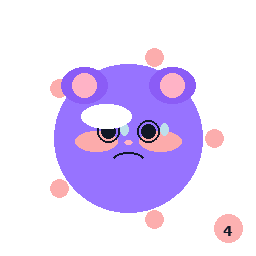
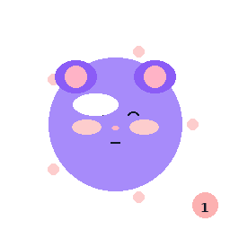
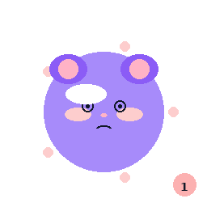
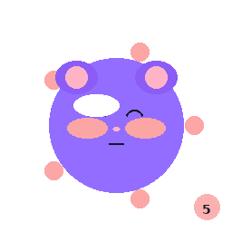
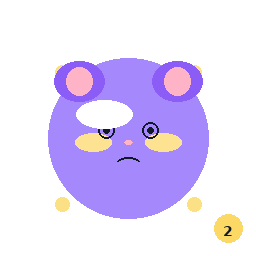
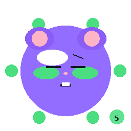
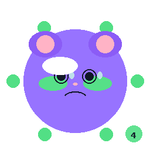
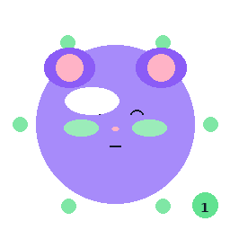

# 45번 — 아트 에셋 v2 이미지 개선 보고서 · 소울나루

45번 — 아트 에셋 v2 이미지 개선 보고서 · 소울나루 

# 🖼️ 아트 에셋 v2 이미지 개선 보고서

**2D 제작 기준 업데이트:** 본 문서의 캐릭터/오브젝트/씬 산출물은 정식 이미지 제작 단계에서 2D가 아닌 2D PNG/SVG 스프라이트와 UI 이미지 기준으로 작업합니다. 상세 통합 지침은 [79번 디자인 가이드 및 작업지시서](/benny/79_디자인가이드_작업지시서.html)를 따릅니다.

**문서번호**: 45  |  **버전**: v1.0  |  **작업일**: 2026-04-16 08:37~10:50 KST  |  **작성**: AI PM Alex

**작업 근거**: 43번 팀간 크로스체크 → 44번 개선 적용 보고서 → 이미지 실반영 버전업

✅ v2 이미지 개선 완료 요약

43·44번 크로스체크 결과를 이미지에 직접 반영하여 UI 시안 13종(@2x 포함 26종), 스프라이트 75종, 이미지 레이어 13종을 전면 재생성했습니다.

문서 37·38·39·40·41번을 **v1.3**으로 버전업하고 새 이미지 갤러리를 삽입했습니다.

26
UI 시안 (1x+2x)

75
스프라이트

13
이미지 레이어

5
업데이트 문서

## 1. BreathingGuide UI v2 개선 내역 (37번 → v1.3)

v1 (이전)

- 단색 배경

- Hold-in 상태 색상 미정의

- 타이머 텍스트 소형

- 접근성 진행 표시 없음

- 베니 얼굴 단순 원형

v2 (현재)

- 그라디언트 배경 (상태별 컬러)

- Hold-in: #5B21B6 다크퍼플 (CX-06 ✅)

- 타이머 72pt 대형, 그림자 효과

- 좌측 세로 진행 바 (접근성 CX-07 ✅)

- 베니 귀·눈·뺨·입 디테일 강화

- 파동 효과 (3겹 링)

- 상태별 베니 뱃지 표시

### 🖼️ BreathingGuide UI 5종 갤러리

대기 (Idle)

보라 링 · 베니 평온

준비 상태 

들숨 (Inhale)

#7C3AED · 확장 원

4초 카운트 

멈춤 (Hold-in)

**#5B21B6 CX-06✅**

신규 색상 적용 

날숨 (Exhale)

#059669 · 민트그린

축소 원 

완료 (Done)

베니 기쁨 · 🎉 이펙트

완료! 

## 2. Check-In UI v2 개선 내역 (38번 → v1.3)

v1 (이전)

- 피곤 감정 별도 존재 (CX-01 오류)

- 감정 이모지만 표시 (텍스트 없음)

- 강도 버튼 동일 크기

- 접근성 레이블 없음

v2 (현재)

- 5감정 체계 확정 — 피곤 제거 (CX-01 ✅)

- 이모지 + 텍스트 레이블 동시 표시 (CX-07 ✅)

- 강도 버튼 크기 차등 (1→5 점점 커짐)

- Step 1→2→3 연결 스토리 (베니 응답 말풍선)

- 완료 화면 성장 포인트 +15 표시

- 스트릭 연속 달성 표시

### 🖼️ Check-In UI 8종 갤러리

Step 1 — 감정 선택
5감정 카드 (CX-01 피곤 제거)

Step 2 — 기쁨 😊
강도 1~5 차등 크기

Step 2 — 슬픔 😢
#1D4ED8 블루 테마

Step 2 — 화남 😠
#BE123C 레드 테마

Step 2 — 불안 😰
#6D28D9 퍼플 테마

Step 2 — 평온 😌
#059669 그린 테마

Step 3 — 확인
베니 응답 말풍선

완료 화면
+15pt · 스트릭

## 3. 스프라이트 v2 개선 내역 (39·40·41번 → v1.3)

v1 (이전)

- 단계별 컬러 차이 미미

- 강도 차이 표현 부족

- 뺨·귀 단순 원

- 눈물·땀방울 없음

v2 (현재)

- 3단계 꽃잎 5개 장식 + #FCA5A5 뺨 (CX-11 ✅)

- 4단계 열매 4개 장식 + #FCD34D 뺨

- 5단계 나뭇잎 6개 장식 + #4ADE80 뺨

- 감정·강도별 세밀한 표정 (눈물, 땀방울, 치아 등)

- 강도 뱃지 우하단 표시

- 그림자 + 몸 하이라이트

### 🌸 Stage 3 — 개화 스프라이트 (감정별 Lv1·3·5)

😊 기쁨 Lv.5

😢 슬픔 Lv.3

😠 화남 Lv.5

😰 불안 Lv.4

😌 평온 Lv.1

😊 기쁨 Lv.1

😢 슬픔 Lv.5

😠 화남 Lv.1

😰 불안 Lv.1

😌 평온 Lv.5

### 🍓 Stage 4 — 열매 스프라이트 (감정별 Lv1·3·5)

😊 기쁨 Lv.5

😢 슬픔 Lv.3

😠 화남 Lv.5

😰 불안 Lv.4

😌 평온 Lv.1

😊 기쁨 Lv.1

😢 슬픔 Lv.5

😠 화남 Lv.1

😰 불안 Lv.2

😌 평온 Lv.5

### 🌳 Stage 5 — 나무 스프라이트 (감정별 Lv1·3·5)

😊 기쁨 Lv.5

😢 슬픔 Lv.3

😠 화남 Lv.5

😰 불안 Lv.4

😌 평온 Lv.1

😊 기쁨 Lv.1

😢 슬픔 Lv.5

😠 화남 Lv.1

😰 불안 Lv.2

😌 평온 Lv.5

## 4. 이미지 레이어 v2 개선 내역

v1 (이전)

- 단순 단색 배경

- Shadow 맵 평면 (128,128,255)

- Highlight 발광 영역 단순

- 계절 이미지 레이어 패턴 없음

v2 (현재)

- BaseColor: 그라디언트 + 단계별 액센트 패턴 (CX-11 컬러 적용)

- Shadow: 구형 굴곡 + 랜덤 범프 디테일

- Highlight: 눈 발광 + 단계별 장식 발광 (열매/나뭇잎)

- 계절 BaseColor: Spring 벚꽃, Summer 잎, Autumn 단풍, Winter 눈송이

### 🎨 Stage 3·4·5 이미지 레이어 갤러리

Stage 3 BaseColor
#FCA5A5 피치핑크 패턴 

Stage 3 Shadow
DirectX 기준 구형 굴곡 

Stage 3 Highlight
눈 + 꽃잎 발광 

Stage 4 BaseColor
#FCD34D 골든옐로 패턴 

Stage 4 Shadow

Stage 4 Highlight
눈 + 열매 발광 

Stage 5 BaseColor
#4ADE80 라임그린 패턴 

Stage 5 Shadow

Stage 5 Highlight
눈 + 나뭇잎 6개 발광 

### 🌿 계절 BaseColor 이미지 레이어 갤러리 (5단계 나무)

🌸 봄 (Spring)
벚꽃 패턴 

🌿 여름 (Summer)
초록 잎 패턴 

🍂 가을 (Autumn)
단풍 점 패턴 

❄️ 겨울 (Winter)
눈송이 패턴 

## 5. v1.3 업데이트 문서 목록

| 문서 | 이전 버전 | 현재 버전 | 주요 변경 |
| --- | --- | --- | --- |
| [37번 BreathingGuide UI 스펙](37_BreathingGuide_UI_디자인스펙.html) | v1.2 | v1.3 | Hold-in 색상 #5B21B6 이미지 반영 · 접근성 진행바 · 갤러리 교체 |
| [38번 CheckIn UI 스펙](38_CheckIn_UI_강화_디자인스펙.html) | v1.2 | v1.3 | 5감정 체계 이미지 반영 · 강도 차등 크기 · 갤러리 교체 |
| [39번 Stage 3 개화 스펙](39_베니3단계_개화_아트에셋스펙.html) | v1.1 | v1.3 | #FCA5A5 뺨·꽃잎 반영 · 갤러리 교체 |
| [40번 Stage 4 열매 스펙](40_베니4단계_열매_아트에셋스펙.html) | v1.1 | v1.3 | #FCD34D 뺨·열매 반영 · 갤러리 교체 |
| [41번 Stage 5 나무 스펙](41_베니5단계_나무_아트에셋스펙.html) | v1.1 | v1.3 | #4ADE80 뺨·나뭇잎·계절 이미지 레이어 반영 · 갤러리 교체 |

📋 관련 문서

[43번 — 팀간 크로스체크 토론 보고서](43_팀간_크로스체크_토론보고서.html)

[44번 — 크로스체크 개선 적용 보고서](44_크로스체크_개선적용보고서.html)

[42번 — 아트팀 산출물 완료 보고서 (v1)](42_아트팀_산출물_완료보고서.html)
