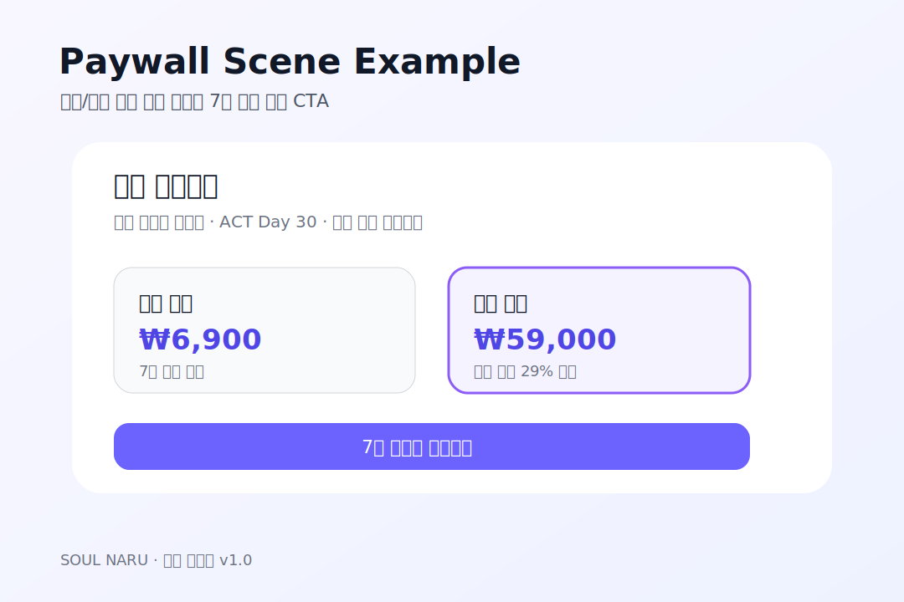

# 70번 — IAP 상품 등록 명세서 · 소울나루

70번 — IAP 상품 등록 명세서 · 소울나루 

# 💳 인앱 결제(IAP) 상품 등록 명세서

**문서번호:** 70  | 
**버전:** v1.0  | 
**FB 항목:** FB-20  | 
**담당:** 개발 A + PM  | 
**작성일:** 2026-04-29  | 
**마감:** 4/30 등록 완료

⏳ **진행 중** — iOS 월간 상품 입력 완료 / 연간 입력 중 / Google Play 4/30 예정.

Paywall 씬 스크린샷은 Sprint 5 완성 후 업로드 (심사 제출은 5/7 예정).

## 0. Paywall 예시 이미지

월간/연간 구독 상품과 CTA 구조 예시

## 1. 구독 상품 확정 스펙

🍎 App Store Connect (iOS)

| 항목 | 월간 (Monthly) | 연간 (Annual) |
| --- | --- | --- |
| 상품 ID | com.soulnaru.benny.monthly | com.soulnaru.benny.annual |
| 구독 그룹 | 베니 프리미엄 (Benny Premium) | |
| 표시 이름 (한국어) | 베니 월간 구독 | 베니 연간 구독 |
| 표시 이름 (영어) | Benny Monthly | Benny Annual |
| 가격 | ₩6,900 / $4.99 | ₩59,000 / $39.99 |
| 무료 체험 | 7일 | 7일 |
| 갱신 주기 | 1개월 | 1년 |
| 설명 (한국어) | 감정 기록 무제한 + 베니 정원 전체 + 호흡 가이드 | 연간 구독 — 월간 대비 29% 할인 |
| 등록 상태 | 입력 완료 | 입력 중 |

🤖 Google Play Console (Android)

| 항목 | 월간 (Monthly) | 연간 (Annual) |
| --- | --- | --- |
| 상품 ID | benny_premium_monthly | benny_premium_annual |
| 기준 가격 | ₩6,900 | ₩59,000 |
| 무료 체험 | 7일 | 7일 |
| 갱신 주기 | 1개월 | 1년 |
| 등록 상태 | 4/30 예정 | 4/30 예정 |

## 2. Free Tier 제한 정책

| 기능 | Free | Premium |
| --- | --- | --- |
| 일일 감정 체크인 | 3회 | 무제한 |
| 베니 성장 단계 | 1~2단계 | 1~5단계 |
| BreathingGuide | 1일 1회 | 무제한 |
| ACT 미션 (Day 1~30) | Day 1~7 | Day 1~30 전체 |
| 정원 오브젝트 | 기본 5종 | 전체 15종 |
| Album (감정 히스토리) | 최근 7일 | 전체 기간 |
| 위기 감지 & 1393 연결 | ✅ 항상 제공 | ✅ 항상 제공 |

* 위기 기능은 무료/유료 관계없이 항상 제공 (안전 원칙)

## 3. RevenueCat 연동 설정

1

RevenueCat 프로젝트 생성

대시보드에서 "Benny (소울나루)" 앱 생성 → iOS App ID + Android Package Name 등록

iOS App ID: `com.soulnaru.benny` | Android: `com.soulnaru.benny`

2

API Key 발급 및 Unity 프로젝트 적용

RevenueCat 대시보드 → API Keys → Public App Key 발급

`Purchases.Configure("rc_app_xxx", appUserId: userId)`

`appUserId`는 Supabase/Firebase UID 사용

3

상품 EntitlementID 매핑

RevenueCat Entitlement: `premium`

→ iOS: `com.soulnaru.benny.monthly`, `com.soulnaru.benny.annual`

→ Android: `benny_premium_monthly`, `benny_premium_annual`

Offerings 이름: `default`

4

Sandbox 테스터 등록

App Store Connect → Users → Sandbox Testers → 테스터 이메일 등록 (QA팀 3명)

Google Play → 내부 테스트 → 테스터 목록에 QA팀 이메일 추가

5

Unity RevenueCat SDK 연동 코드

Packages 폴더에 RevenueCat Unity SDK 추가 (v4.x)

PaywallManager.cs에서 결제 플로우 구현 — 71번 Sprint 5 준비 문서 참조

// PaywallManager.cs — RevenueCat 기본 연동
using Purchases;

public class PaywallManager : MonoBehaviour {
async void Start() {
Purchases.Configure("rc_public_key", userId: AuthManager.CurrentUserId);
}

// 구독 목록 로드
public async Task LoadOfferings() {
var offerings = await Purchases.GetOfferingsAsync();
var current = offerings.Current;
var monthly = current.Monthly; // 월간 패키지
var annual = current.Annual; // 연간 패키지
DisplayPaywall(monthly, annual);
}

// 결제 처리
public async Task Purchase(Package package) {
var result = await Purchases.PurchasePackageAsync(package);
if (result.CustomerInfo.Entitlements["premium"].IsActive) {
// 결제 성공 → 프리미엄 활성화
UserManager.SetPremium(true);
FirestoreManager.LogPurchase(package.PackageType.ToString());
}
}

// 복원
public async Task RestorePurchases() {
var info = await Purchases.RestorePurchasesAsync();
bool isPremium = info.Entitlements["premium"].IsActive;
UserManager.SetPremium(isPremium);
}
} 

## 4. QA 검증 계획 (Sprint 5: 5/4~5)

| 케이스 | 내용 | 환경 |
| --- | --- | --- |
| IAP-01 | 월간 구독 Sandbox 결제 E2E 성공 | iOS Sandbox + Android 테스트 |
| IAP-02 | 연간 구독 Sandbox 결제 E2E 성공 | iOS Sandbox + Android 테스트 |
| IAP-03 | 무료 체험 7일 적용 확인 | 신규 계정 |
| IAP-04 | 구독 복원 (Restore Purchases) | 기기 재설치 시나리오 |
| IAP-05 | 결제 실패 처리 (카드 거절 시뮬레이션) | Sandbox 오류 케이스 |
| IAP-06 | Premium 활성화 후 기능 잠금 해제 확인 | iOS + Android |

## 5. 체크리스트

- App Store Connect — 구독 그룹 생성

- App Store Connect — 월간 상품 기본 입력 ($4.99)

- App Store Connect — 연간 상품 입력 중 ($39.99)

- App Store Connect — Sandbox 테스터 3명 등록

- Google Play Console — 구독 상품 2종 등록 (4/30)

- RevenueCat 프로젝트 생성 + API Key 발급 (4/30)

- Unity RevenueCat SDK 설치 (5/1 Sprint 5 Day 1)

- PaywallManager.cs 구현 (5/1~4)

- IAP E2E QA (5/4~5)

- App Store Connect 심사 제출 (5/7)

관련 문서:
[58번 Sprint 5 플래닝](/benny/58_Sprint5_플래닝문서.html) ·
[17번 BM 명세서](/benny/17_BM_명세서_수익모델.html) ·
[69번 긴급 리포트](/benny/69_FB긴급_완료확인_리포트_4월29일.html) ·
[71번 Sprint 5 준비](/benny/71_Sprint5_준비체크리스트.html)
