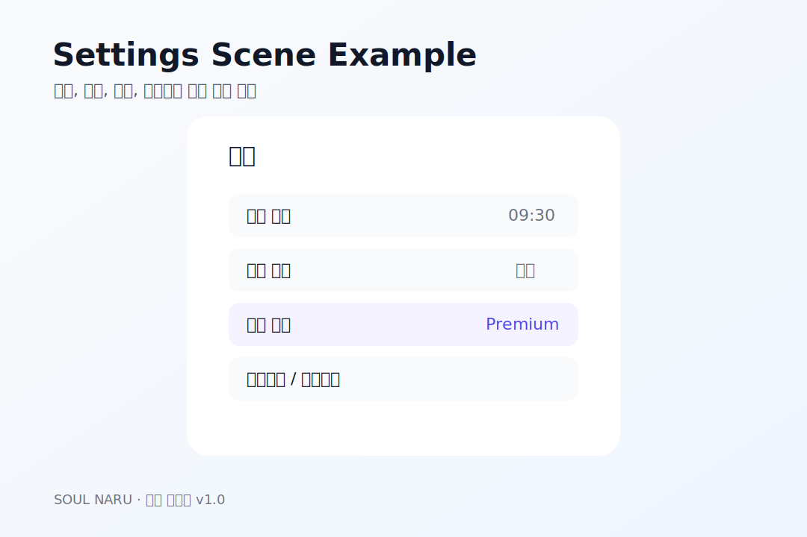
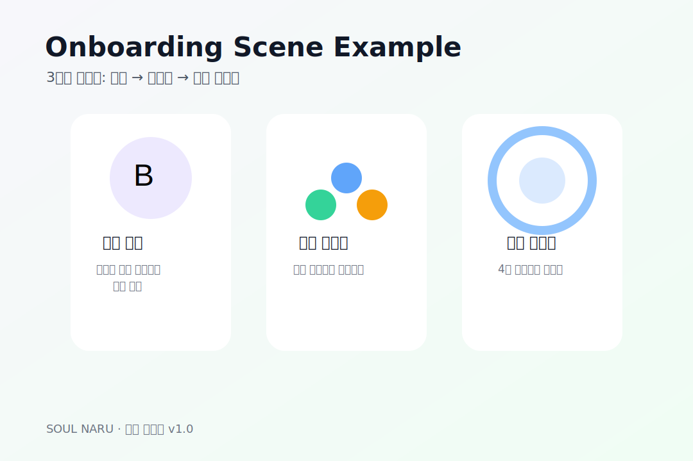

# 74번 — Sprint 5 Settings·Onboarding·Paywall 씬 명세 · 소울나루

74번 — Sprint 5 Settings·Onboarding·Paywall 씬 명세 · 소울나루 

# 🎬 Sprint 5 신규 씬 3종 명세서

**문서번호:** 74  | 
**버전:** v1.0  | 
**Sprint:** 5 (5/1~5/7)  | 
**담당:** 개발 B·C + 아트팀  | 
**대상 씬:** Settings · Onboarding · Paywall

📐 **세 씬의 전체 UI·기능·플로우 명세.** 개발 B(Onboarding·Paywall)·C(Settings) + 아트팀이 독립적으로 구현 가능하도록 작성됨.

## 0. 씬 예시 이미지

Settings 예시

Onboarding 예시

Paywall 예시

⚙️

Settings.unity

담당: 개발 C · 완성 목표: 5/3

P0 

### UI 구성

진입 위치
Garden·Album·CheckIn 공통 — 우측 상단 ⚙️ 아이콘 탭

배경
반투명 오버레이 (기존 씬 위 슬라이드 패널) 또는 전용 씬 전환

헤더
← 뒤로가기 + "설정" 텍스트

프로필 섹션
아바타 이미지 + 이름 텍스트 + "편집" 버튼

알림 설정
Toggle On/Off + 시간 선택 피커 (일일 체크인 알림, HH:MM)

구독 관리
현재 플랜 배지(Free/Monthly/Annual) + "업그레이드" 버튼 → Paywall 이동

개인정보처리방침
외부 링크 (URL 기획팀 확정 예정)

이용약관
외부 링크 (URL 기획팀 확정 예정)

로그아웃
확인 다이얼로그 "로그아웃 하시겠어요?" → 확인 시 세션 초기화 + Login 씬 이동

버전 정보
v{Application.version} 자동 주입, 회색 텍스트

### 핵심 로직

// SettingsManager.cs
public class SettingsManager : MonoBehaviour {
// 알림 시간 저장 (PlayerPrefs)
public void OnNotificationTimeSaved(int hour, int minute) {
PlayerPrefs.SetInt("NotifHour", hour);
PlayerPrefs.SetInt("NotifMinute", minute);
FCMScheduler.RescheduleDaily(hour, minute);
}

// 로그아웃
public async void OnLogoutConfirmed() {
await AuthManager.SignOut();
UserManager.ClearAll();
SceneManager.LoadScene("Login");
}
} 

### QA 체크리스트

| 항목 | 기준 |
| --- | --- |
| 알림 Toggle 동작 | On/Off 전환 후 FCM 스케줄 반영 확인 |
| 시간 피커 | 00:00~23:59 선택 가능, 저장 후 유지 |
| 구독 배지 | Free/Monthly/Annual 플랜 정확히 표시 |
| 로그아웃 | 다이얼로그 후 Login 씬 이동, 세션 초기화 |
| 외부 링크 | 개인정보·이용약관 링크 정상 오픈 |

👋

Onboarding.unity

담당: 개발 B + 아트 E · 완성 목표: 5/5

P0 

### 발동 조건

앱 최초 실행 시 (PlayerPrefs `onboarding_complete` 키 없을 때) → Onboarding 씬 자동 진입

### 3단계 플로우

1

베니 소개

일러스트: 베니 2단계 + 배경
카피: "안녕하세요! 저는 베니예요. 🐰 여러분의 감정을 함께 바라볼 작은 친구가 되고 싶어요."
버튼: "다음 →" + "건너뛰기"

2

감정 체크인 소개

일러스트: 감정 아이콘 원형 배치 + 체크인 화면 미리보기
카피: "오늘 어떤 감정을 느끼셨나요? 🌿 어떤 감정이든 괜찮아요."
버튼: "다음 →" + "이전 ←"

3

호흡 가이드 소개 + 권한 요청

일러스트: 호흡 애니메이션 미리보기
카피: "긴장될 때, 호흡을 함께 해봐요. 🌬️"
버튼: "시작하기" (완료) → 권한 요청 (iOS: 알림, ATT)
완료 시: PlayerPrefs `onboarding_complete` = true → Garden 씬

### UI 스펙

페이지 인디케이터
하단 점 3개 (현재 단계 강조)

배경
라벤더 그라데이션 #F5F0FF → #EDE9FE

일러스트 영역
화면 상단 60% | 1080×1080px PNG

텍스트 영역
하단 40% | 카피 폰트 18pt NotoSansKR

건너뛰기 버튼
1단계에서만 표시 (우측 상단) → 3단계로 점프 후 완료 처리

스와이프
좌우 스와이프로 단계 이동 (선택 사항)

### 아트 요청 (아트 E)

| 에셋 | 규격 | 납기 |
| --- | --- | --- |
| onboarding_step1.png (베니 소개) | 1080×1080px, PNG | 5/3 |
| onboarding_step2.png (감정 아이콘) | 1080×1080px, PNG | 5/4 |
| onboarding_step3.png (호흡 안내) | 1080×1080px, PNG | 5/5 |

💎

Paywall.unity

담당: 개발 A+B + 아트 D · 완성 목표: 5/5

P0 

### UI 구성

헤더
✕ 닫기 버튼 + "베니 프리미엄" 타이틀

혜택 목록
아이콘 + 텍스트 4~5개: 체크인 무제한 / ACT Day 30 / 정원 전체 / 위기 즉시 연결

플랜 선택
월간(₩6,900) / 연간(₩59,000 · 29% 절약) 라디오 버튼 선택

메인 CTA 버튼
"7일 무료로 시작하기" (기본) / "구독하기" (체험 후) — 색상 #6C63FF

하단 링크
"구매 복원하기" + "개인정보처리방침" + "이용약관"

베니 일러스트
3단계 or 5단계 베니 (팬아트 느낌, 프리미엄 강조)

### 진입 경로

- Free 사용자가 프리미엄 기능 접근 시 (FreeGatekeeper → PaywallPrompt)

- Settings 씬 "구독 관리" → "업그레이드" 버튼

- Garden 씬 우측 상단 👑 아이콘 (프리미엄 CTA)

### 아트 요청 (아트 D)

| 에셋 | 규격 | 납기 |
| --- | --- | --- |
| paywall_bg.png (배경) | 1080×1920px, 라벤더 톤 | 5/2 |
| paywall_benny.png (베니) | 512×512px, 투명 PNG | 5/2 |
| paywall_icon_*.png (혜택 아이콘 5종) | 64×64px, PNG | 5/3 |

## 씬별 완료 일정 요약

| 씬 | 담당 | 착수 | 완성 목표 | QA |
| --- | --- | --- | --- | --- |
| Settings.unity | 개발 C | 5/1 | 5/3 | 5/5~6 |
| Onboarding.unity | 개발 B | 5/3 | 5/5 | 5/5~6 |
| Paywall.unity | 개발 A+B | 5/1 | 5/5 | 5/4~5 |

관련 문서:
[72번 킥오프](/benny/72_Sprint5_킥오프_리포트.html) ·
[73번 결제 기술](/benny/73_Sprint5_결제연동_기술명세.html) ·
[70번 IAP](/benny/70_IAP_상품등록_명세서.html)
