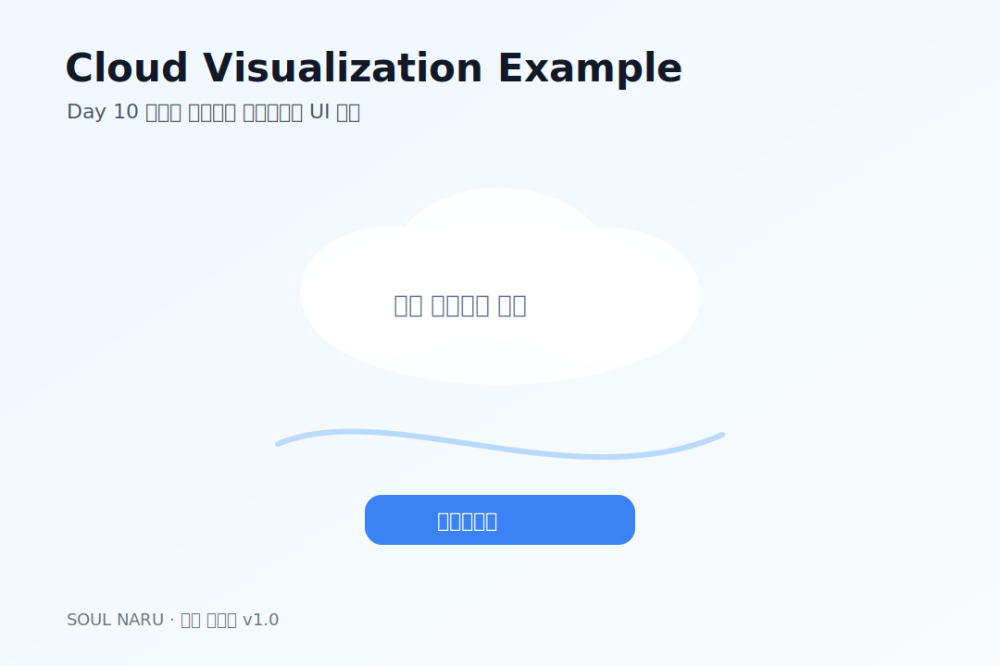

# 76번 — 이미지 제작 가이드 & 예시 이미지 적용본 · 소울나루

76번 — 이미지 제작 가이드 & 예시 이미지 적용본 · 소울나루 **# 신규 문서 이미지 제작 가이드 & 예시 이미지 적용본
대상:** 60번, 70번, 73번, 74번 등 UI/이미지 가이드가 포함된 신규 문서  |  **목적:** 개발·아트팀이 같은 방향으로 구현 가능한 예시 시각화 제공
이미지는 실제 최종 아트가 아니라 **문서 이해용 예시 이미지**다. 색상, 배치, 정보 위계를 먼저 맞추고 최종 일러스트는 아트팀 산출물로 교체한다.

## 1. 공통 제작 원칙

- Pretendard 기반 텍스트, Regular~Medium 위주 사용
- 배경은 라벤더/화이트/연한 블루 계열로 통일
- 핵심 CTA는 1개만 강조
- 문서 삽입 이미지는 1080×720 또는 1080×1920 기준으로 제작
- 실제 Unity UI에서는 Safe Area를 고려해 상하 여백을 확보 
## 2. Paywall 예시 이미지

70·73·74번 문서 적용용 Paywall 예시. 월간/연간 플랜과 CTA 우선순위를 보여준다.

## 3. Onboarding 예시 이미지

74번 Onboarding 씬 명세 적용용. 3단계 소개 흐름을 카드형으로 시각화.

## 4. Settings 예시 이미지

74번 Settings 씬 명세 적용용. 알림/계정/구독/정책 메뉴 구조를 단순화해 표현.

## 5. Cloud Visualization 예시 이미지

60번 Day 10 시각화 UI 적용용. 생각을 구름처럼 띄우고 흘려보내는 구조.

## 6. 문서별 적용 대상

| 문서 | 적용 이미지 | 용도 |
| --- | --- | --- |
| 60번 Day 10 시각화 UI | cloud_visualization_example.svg | CloudVisualizationManager UI 이해 |
| 70번 IAP 상품 등록 | paywall_example.svg | 상품 구조와 CTA 확인 |
| 73번 결제 연동 기술 명세 | paywall_example.svg | 기술 플로우와 UI 연결 이해 |
| 74번 신규 씬 3종 명세 | paywall/onboarding/settings 예시 | 개발·아트 병렬 작업 기준 |
